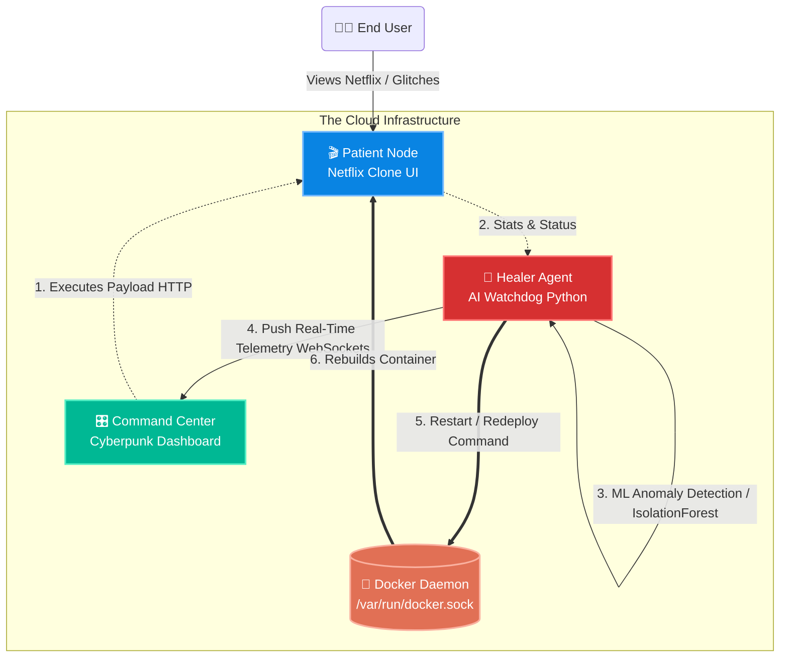

<div align="center">
  
  
  <br/>
  <h1>🛡️ SENTINELS</h1>
  <h3>An AI-Driven Self-Healing Cloud Ecosystem</h3>

  <p>
    
    
    
    
    
  </p>
</div>

<hr/>

## 📖 Project Overview

**SENTINELS** is a state-of-the-art, full-stack demonstration of an autonomous, AI-driven cloud infrastructure. It implements **Chaos Engineering** principles by allowing users to intentionally inject critical failures (CPU spikes, memory leaks, fatal crashes) into a live web application, and visually demonstrates how a containerized Artificial Intelligence Watchdog detects, analyzes, and organically remediates these anomalies in real-time with zero human intervention.

This project was built to showcase advanced DevOps practices, machine learning-driven anomaly detection, and microservice orchestration.

---

## 🎯 Core Objectives

1. **Autonomous Remediation:** Prove that an AI model can safely manage infrastructure by monitoring system telemetry and executing Docker lifecycle commands.
2. **Chaos Engineering:** Expose applications to intentional failures to observe system resilience and validation thresholds.
3. **Real-Time Visibility:** Provide a zero-latency, highly visual representation of cloud health, removing the abstraction of backend infrastructure.

---

## 🏗️ Architectural Diagram

The ecosystem is built upon a loosely coupled, fully containerized microservices architecture orchestrated via Docker Compose.



---

## 🧩 The Microservices

### 1. The Patient (Netflix Clone) `Port 5000`
The "Target Node." A visually polished Netflix clone built with HTML/CSS and Flask. It includes an aggressive **500ms JavaScript heartbeat**. 
- If the backend suffers latency, the UI locks and overlays a heavy red buffering spinner.
- If the backend fatally crashes, the DOM is completely detached and replaced with a Netflix `503 Service Unavailable` black screen.

### 2. The Command Center `Port 8080`
An "Industrial Sci-Fi" Operations Dashboard. Built entirely on a strict CSS Grid layout to prevent scrolling, it acts as the mission control for the ecosystem.
- **Flask-SocketIO:** Streams zero-latency telemetry directly to the browser.
- **Live Charts:** Chart.js graphs tracking CPU, RAM, and Network Latency metrics.
- **Chaos Console:** Big, tactile buttons allowing the user to inject CPU Stresses, Memory Leaks, Lag, and Hard Kills directly into the Patient.

### 3. The Healer Agent `Background Service`
A containerized Python script utilizing Scikit-Learn's `IsolationForest` ML model.
- It mounts the host system's `/var/run/docker.sock`, granting it the authority to monitor and execute lifecycle commands on sibling containers.
- Implements a **15-Second Suspense Delay**: When an anomaly is detected, the AI pauses to allow the dashboard to glow red and the UI to crash, providing absolute visual clarity of the attack before initiating the automatic reboot protocol.

---

## 💥 Chaos Engineering Scenarios

| Attack Vector | System Response | Visual Result |
|---|---|---|
| **CPU Stress** | The Python backend blocks the main thread in a massive loop. Latency skyrockets. | Dashboard graphs peak at 100%. The Netflix clone throws a heavy "Buffering" overlay. |
| **Memory Leak** | A global array appends 100MB of static data per hit until the container OOM-Kills. | Memory graph climbs sequentially until the system flatlines. |
| **Connection Lag** | The HTTP endpoint purposefully sleeps for 15 seconds, simulating a DDoS connection backlog. | The UI freezes and the AI Watchdog detects the severe latency threshold breach. |
| **Hard Crash** | The Flask worker is forcibly killed (`os._exit(1)`). | The Netflix Clone DOM vanishes, replaced seamlessly by a 503 Service Unavailable error page. |

---

## 🚀 How to Run the Demonstration

### Prerequisites
- Docker & Docker Compose installed and running.
- Windows/Linux/Mac OS.

### One-Click Launch
1. Open a terminal in the root `sentinels/` directory.
2. Run the deployment script:
   ```bash
   .\run_demo.bat
   ```
   *(For Linux/Mac: run `docker-compose up -d --build`)*

### the Visual Setup
1. Open your browser to the **Patient Application**: [http://localhost:5000](http://localhost:5000)
2. Open a new window to the **Command Center**: [http://localhost:8080](http://localhost:8080)
3. Arrange these windows side-by-side.

### Executing the Attack
- Click the **`[X] EXECUTE HARD CRASH`** button on the Command Center.
- **Watch closely**: The Netflix clone will instantly die, displaying a 503 screen. The dashboard status will flash **CRITICAL FAILURE**. The AI Terminal will type `Pending Analysis...`.
- Count to 15 seconds.
- The AI will execute a container restart, log the successful remediation, and the Netflix clone will **organically reload back to full health!**

---

<div align="center">
  <i>Developed to showcase the intersection of Cloud Computing, DevOps, and Machine Learning.</i>
</div>
